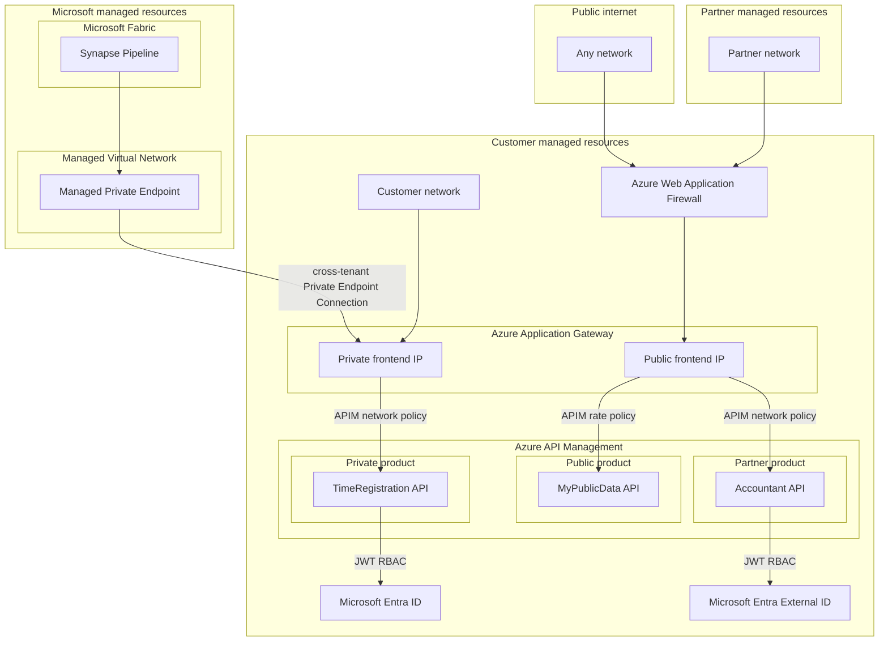
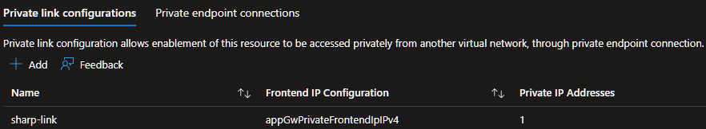
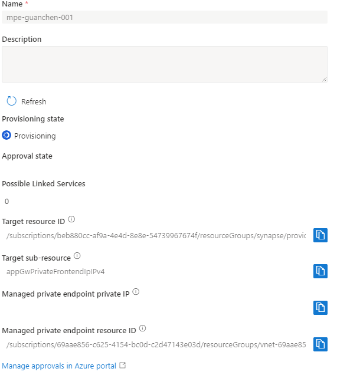
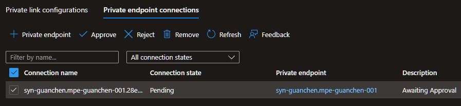
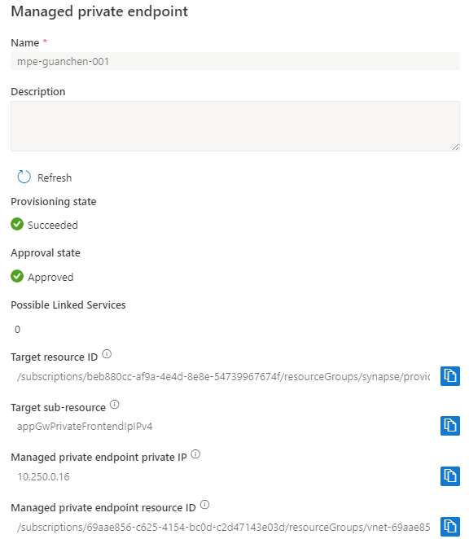
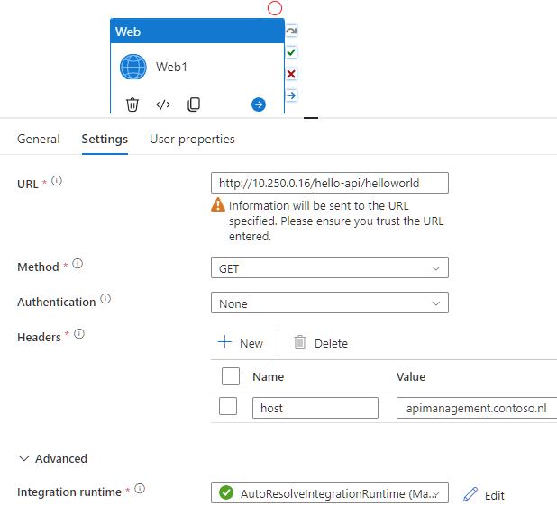
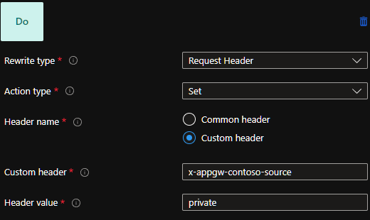
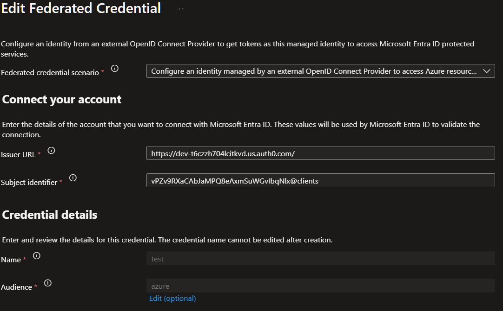

# Reference architecture for secure cross-tenant API traffic #

[![CC BY-NC-SA 4.0][cc-by-nc-sa-shield]][cc-by-nc-sa]

The Azure landscape steadily moves to Microsoft managed product-suites. Previously, we had the option to provision Azure Purview in our own Azure subscription, but now we have [Microsoft Purview](https://learn.microsoft.com/purview/purview). Similarly, Azure Synapse Analytics and Data Factory were available for provisioning in our subscription, but now we have [Microsoft Fabric](https://www.microsoft.com/microsoft-fabric). This shift isn't merely about rebranding; it represents a move from managing Azure resources within our own subscription to managing them within Microsoft's tenant. As a consequence, there's an implicit cross-tenancy relationship with Microsoft across various levels, including the network.

To maintain the concept of traditional private network connections in this cross-tenant environment, Microsoft introduced the concept of managed private endpoints. These endpoints allow secure connections from Microsoft's network, via Managed Virtual Networks in their tenant, to our own Virtual Networks.

With the increasing standardization of traffic flowing through networks via API protocols, APIs and their traffic are becoming the focal point of modern IT architecture. Well-designed APIs and their traffic are now regarded as [first-class citizens](https://douglasmoura.dev/en-US/what-is-a-first-class-citizen-in-computer-science) in mature IT architectures, given the interconnected nature of the modern world through APIs.

In this landscape, centralized tooling becomes crucial to simplify API traffic and securely connect APIs across tenants. Azure Virtual Network remains a powerful tool for facilitating network connections to the cloud or on-premises, while Azure API Management serves as an excellent platform for centralizing API traffic.

The following reference architecture for secure cross-tenant API traffic preserves the idea of private network connections, and makes use of a **single** API Management instance to centralize and manage **all** API traffic for an organization. This setup not only eliminates the need of IaaS gateway products like [self-hosted integration runtimes](https://learn.microsoft.com/en-us/azure/data-factory/create-self-hosted-integration-runtime) that facilitate bridged networking, it also tries to set the standard for what a good tenant architecture for APIs looks like.

## Technical reference architecture ##

Following is the technical reference architecture diagram. The diagram consist of the following components:

- The Microsoft managed resource block signifies the Microsoft tenant, which is managed by Microsoft, but where the customer has some ownership over and can trust as traffic of their own.

- The public internet and partner managed resources block signifies the traditional network landscape, with no direct link to a tenant, nor to Azure. This is traffic we cannot fully trust.

- The customer managed resource block signifies the tenant you own, where you have full ownership over. Which contains WAF functionality to filter and control the traditional network landscape outside of your own, and an Azure Application Gateway where traditional and modern cross-tenant traffic comes together.

  - In addition, an Azure API Management resource is placed behind the Azure Application Gateway to centralize standardized APIs. This Azure API management resource differentiates and controls the flow of traffic through [product polices](https://learn.microsoft.com/en-us/azure/api-management/api-management-howto-policies#scopes).
  - Finally, Microsoft Entra ID is placed as the authorization component for secure APIs for internal use. Microsoft Entra External ID is placed as the authorization component for partner use.

The diagram:

## Reference implementation for Microsoft managed origins ##

Following is a reference implementation for traffic originating from Microsoft managed resources, as a part of the architecture.

### Prerequisites ###

- A resource compatible with managed private endpoints for Azure Application Gateway, for instance  [Microsoft Fabric](https://learn.microsoft.com/en-us/fabric/security/security-managed-private-endpoints-create#supported-data-sources) or Synapse. This resource has to be provisioned inside a Managed Virtual Network.
- An Azure Application Gateway.
  - If the gateway already has a public frontend port on 443, make sure to create a private frontend port on 443 as well, using both public and private on 443 requires a change to the [inbound NSG rules](https://learn.microsoft.com/en-us/azure/application-gateway/configuration-infrastructure#inbound-rules). Only the private frontend port is needed for managed private endpoints.
- [An API Management instance in an internal virtual network, with the Application Gateway](https://learn.microsoft.com/en-us/azure/api-management/api-management-howto-integrate-internal-vnet-appgateway).

### Notes ###

- The configuration steps make use of HTTP on port 80. The intended implementation is HTTPS on port 443, this works, but make sure there is a globally trusted certificate used so resources connecting to the managed private endpoint understand the CA. A custom certificate might not work.
- The configuration steps are through click-ops and only intended to be followed like so in a sandbox environment. In production environments, consider using a mature IaC tool like Bicep, Terraform or Bicep# for a streamlined Bicep experience.

### Configuration steps ###

After following the [prerequisites](#prerequisites), create the connection. This can be done with the following steps:

1. Create a fully working private path in the Application Gateway to a backend. This is not optional, an empty configuration will not allow you to finish the Private link configuration. This means configuring:
   1. a private `fronted IP configuration`, in this example it's called `appGwPrivateFrontendIpIPv4`.
   2. a `listener` on the private `fronted IP configuration`, listening on `apimanagement.contoso.nl` for example.
   3. a `backend` (pool and settings), pointing towards your backend service, for instance an API Management private IP.
   4. an associated `rule` to chain together the `listener` to the `backend`.

2. Create a `Private link configuration` in the Application Gateway. This will enable (managed) private endpoint connection support for the selected `Frontend IP configuration`, either the `Public`, or `Private` type, but it only makes sense to select `Private` type in order to preserve a secure downstream connection. In the following example, the `appGwPrivateFrontendIpIPv4` is configured.

    

3. Create a managed private endpoint for Application Gateway, in this example we create one in Synapse. The target sub-resource is `appGwPrivateFrontendIpIPv4` because we enabled private endpoint connection support for it in the previous step. It should look like this after configuration:

    

4. Approve the connection in the Application Gateway:

    

5. Take notice of the managed private endpoint in Synapse after the approval, there is now a managed private endpoint private IP with value `10.250.0.16`, this is our entry point to the Application Gateway and is a private IP residing in the Managed Virtual Network of Synapse:

    

6. All there is left is using the right settings to utilize the managed private endpoint in Synapse. Because there is no concept of DNS resolution for managed private endpoints for Application Gateway, use the managed private endpoint private IP that was created earlier for the URL field and form a working request, for instance `http://10.250.0.16/hello-api/helloworld`. The [multi-site setup](https://learn.microsoft.com/en-us/azure/application-gateway/multiple-site-overview) does require a valid host, so the host header is used. This setup assumes:
   - the frontend in the Application Gateway listens on requests with host `apimanagement.contoso.nl` on port 80 (as configured in step 1.2)
   - the backend in the Application Gateway accepts GET requests on path `hello-api/helloworld`.

    In `Advanced`, make sure to select the runtime that is connected to the managed virtual network.

    In a `Web` activity it might look like this:

    

### Securing API Management ###

In a setup of the Application Gateway, where both public and private traffic flows trough, it is possible to distinguish between public and private traffic from a backend (API Management) perspective. Create a rewrite set in the Application Gateway and make sure every rule has a rewrite that sets a specific header, where the value will be an identifier for listeners with a private frontend IP and listeners with a public frontend IP, it might look like this:

Configure a root or product policy with logic to identify private traffic based on the newly introduced header with the [Check HTTP header policy](https://learn.microsoft.com/en-us/azure/api-management/check-header-policy) in API Management, in a similar way as [documented for Front Door](https://learn.microsoft.com/en-us/azure/api-management/front-door-api-management#check-front-door-header).

## Identity based security ##

Federated credentials are very powerful for generic identity based security in cross-tenant API scenario's. Any modern identity provider can be used. For every external identity you want to trust, configure a [user-assigned managed identity](https://learn.microsoft.com/en-us/entra/identity/managed-identities-azure-resources/how-manage-user-assigned-managed-identities?pivots=identity-mi-methods-azp) with an [external identity provider](https://learn.microsoft.com/en-us/entra/workload-id/workload-identity-federation-create-trust-user-assigned-managed-identity?pivots=identity-wif-mi-methods-azp#other).

Assign this managed identity a specific API role, or API Management role, defined on a custom Entra ID application, for example via [Assign-Permission.ps1](./Assign-Permission.ps1).

Secure a product or API with a [jwt-policy](https://learn.microsoft.com/en-us/azure/api-management/validate-jwt-policy) and *only* validate the role of the custom Entra ID application.

### Auth0 ###

For Auth0, configure a `Machine to Machine` application. Under `Advanced Settings` - `Grant Types`, enable `Client Credentials`.

For the Managed Identity, it might look like this:

To generate an [access token request with a federated credential](https://learn.microsoft.com/en-us/entra/identity-platform/v2-oauth2-client-creds-grant-flow#third-case-access-token-request-with-a-federated-credential) via Auth0, see [Auth0ClientCred.http](./Auth0ClientCred.http). This eventually returns a token, issued by our own Entra ID tenant, with a role on our own Entra ID application, just what we need for passing the API Management jwt-policy when making requests to an API.

## Considerations ##

1. The `client_ip` or `add_x_forwarded_for_proxy` [server variable](https://learn.microsoft.com/en-us/azure/application-gateway/rewrite-http-headers-url#server-variables) in the Application Gateway is appended with `10.250.0.16` in this example. This is not a practical way to check the source (with an API Management [ip-filter policy](https://learn.microsoft.com/en-us/azure/api-management/ip-filter-policy) for instance), as the managed virtual network ranges are not properly documented, nor are the ranges configurable during provisioning. As a side note: IP-spoofing exists but is proven to be nearly impossible on TCP (which HTTP uses, which we only allow in this API architecture), so it is not a wrong method to consider.

2. An API Management policy can also leverage the [IPrivateEndpointConnection](https://learn.microsoft.com/en-us/azure/api-management/api-management-policy-expressions#ref-iprivateendpointconnection) context information, but that requires an [API Management instance with private endpoint](https://learn.microsoft.com/en-us/azure/api-management/private-endpoint). At this time, using a private endpoint setup restricts the use of outbound VNet integration, so in many cases this isn't a practical setup. Besides that, this example does not connect to an API Management private endpoint, but to a private IP that was selected from the injected VNet, although it should work if you use the private endpoint IP in the backend settings of the Application Gateway.

3. Azure Front Door might be a candidate to replace Azure Application Gateway in the overall architecture, but it isn't supported for Managed private endpoint connections in Microsoft managed origins and [does not support API Management instances with internal mode VNets](https://learn.microsoft.com/en-us/azure/api-management/front-door-api-management#prerequisites).

4. [Azure Private Link-service](https://learn.microsoft.com/en-us/azure/private-link/private-link-service-overview) might be a candidate to replace managed private endpoint for Application Gateway, but it requires placing an Azure Load Balancer as a front, which in turn requires to have an Azure Virtual Machine Scale Set or Virtual Machine as a backend, which just increases complexity and unnecessary IaaS components.

5. To facilitate geo-redundancy in this architecture, Azure API Management can be configured [multi-regional](https://learn.microsoft.com/en-us/azure/api-management/api-management-howto-deploy-multi-region#about-multi-region-deployment) with [load balancing to backends](https://learn.microsoft.com/en-us/azure/api-management/backends?tabs=bicep#load-balanced-pool-preview), but this also requires a geo-redundant front on top of, or as a replacement of, Azure Application Gateway to make the entire flow geo-redundant. This either results in:
    - a combination of Azure Front Door and Azure Private Link-service to replace the Application Gateway, but as consideration 4 shows, it requires an Azure Load Balancer and additional IaaS for the managed private endpoint connection route, and as consideration 3 shows, it requires a different type of API Management setup;
    - an Application Gateway in each region, in combination with [setting up a Traffic Manager Profile similar to the setup specified by Paco de la Cruz](https://pacodelacruz.io/load-balancing-public-and-private-traffic-to-azure-api-management), but with a key difference; pointing the Traffic Manager Profiles to a DNS hostname that resolves to a healthy private or public Application Gateway IP at all times, so for internal traffic to the frontend private IP address of the healthy Application Gateway by private DNS resolution, and for external traffic to the frontend public IP address by public DNS resolution. By doing this, it preserves logic introduced in the Application Gateway. This setup does not solve automatic failover for the (managed) private endpoint connection route, since these do not allow DNS resolution, these services have to implement failover to managed private endpoints IPs on their own way for the time being, which may not be ideal depending on your requirements.

6. The Microsoft managed resource block in the diagram could very well consist of resources from a partner. Which, in some cases, you want to trust as some similar concept like [AD trust relationships](https://learn.microsoft.com/en-us/entra/identity/domain-services/concepts-forest-trust). It would be ideal to draw that connection from the Microsoft managed resource block to a partner API, or even a private API, but there is currently no secure way of recognizing the origin of traffic once it hits an Application Gateway frontend IP, so no further trust can be established at this time. The introduction of an Application Gateway server variable that recognizes the Managed Private Endpoint connection (e.g. `client_managed_private_endpoint_id`) can solve this, but this is up to Microsoft to implement.

## License ##

This work is licensed under a
[Creative Commons Attribution-NonCommercial-ShareAlike 4.0 International License][cc-by-nc-sa].

[![CC BY-NC-SA 4.0][cc-by-nc-sa-image]][cc-by-nc-sa]

[cc-by-nc-sa]: http://creativecommons.org/licenses/by-nc-sa/4.0/
[cc-by-nc-sa-image]: https://licensebuttons.net/l/by-nc-sa/4.0/88x31.png
[cc-by-nc-sa-shield]: https://img.shields.io/badge/License-CC%20BY--NC--SA%204.0-lightgrey.svg
